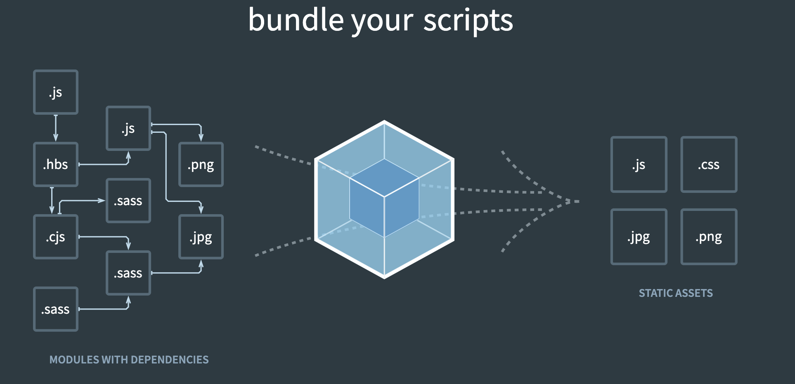

Intro to webpack
================

## SWBATS

- [x] Explain Javascript tooling and how webpack bundles their code
- [x] Initialize npm in a project and install webpack dependencies
- [x] Use `import` and `export` to modularize code
- [ ] Understand how to change settings using a webpack configuration file
- [ ] Run webpack-dev-server to enable hot reloading
- [ ] Understand the differences between running webpack for development and production, and what dependencies we have in development code vs. production code



## What is webpack?

> webpack is a module bundler. Its main purpose is to bundle JavaScript files for usage in a browser, yet it is also capable of transforming, bundling, or packaging just about any resource or asset.

Webpack is part of the modern Javascript tooling ecosystem that helps us solve a few of common problems when working with larger applications. It helps manage our application's dependencies by allowing us to work with modularized code. We can separate code for parts of our application in different files and only use what we need, and we can also bring in additional open source code from other packages into our codebase.

It also also bundles our code to make it more efficient for the browser to download - the browser has to make fewer requests for our bundled code rather than making many requests for separate files.

Webpack is _highly configurable_ and can be used in a variety of ways to solve different problems common to web development.

Our primary focus for the lecture will be using webpack with Javascript files, but it can be configured to work with with many different file types through `loaders` and `plugins`.

## NPM: A brief introduction

NPM stands for node package manager - it's a Javascript package manager similar to Bundler for Ruby. We'll need to use NPM to work with webpack, and NPM is another big part of modern Javascript tooling.

To get started with NPM in our project: 

- `$ npm init` will create a package.json file (similar to a Gemfile in Ruby) that keeps track of your project's dependencies.
- `$ npm install (package-name)` will install a package in your project's node_modules folder. Unlike Bundler, npm saves all the dependencies for a project in the project directory.

## Installing Webpack

- To install the dependencies we'll need for webpack, you should run `$ npm install --save-dev webpack webpack-cli`, this will download the webpack and webpack CLI packages and save them as devDependencies.
- You can also define scripts for npm to run in the package.json file. These are similar to Rake tasks in Ruby (like `rake db:migrate`).
  - To start, add this to the scripts section of your package.json: `"build": "webpack"`. This will run webpack CLI's build program whenever we call `$ npm run build`. 
  - You can also update the configuration for webpack by calling `webpack` with additional arguments. For example, we can have webpack run in development mode by changing our build script to `webpack --mode=development`

## ES6 Module System

In all the projects we've made to date, the only way to include Javascript files in your project is by loading them in the `<script>` tag in your HTML file. Javascript Modules, introduced in ES6, let us reference code in Javascript from _within_ Javascript files. This makes it easier to manage our dependencies because we no longer need to rely on the ordering our of our `<script>` tags, we can `import` code we need directly from the Javascript files.
- This is similar to the `require` statement in Ruby, but in Javascript we can be more specific (`require` will bring in all the code from the specified file, `import` will let us specify what exactly code we want to import).
- There are two kinds of exports, named and default. A file can only have one default export but can have several named exports. As an example, consider we had a file called add.js with the following code in it:

```js
const add = (num1, num2) => num1 + num2

const subtract = (num1, num2) => num1 - num2

const calculator = {
  add: add,
  subtract: subtract
}

// named exports
export { add, subtract }
// default export
export default calculator
```

- If we only need some functionality, we can specify what code we want to import: 

```js
// named import
import { add } from '../utils/add' // relative path to add.js

add(2, 4) // 6
```

- An example of a default import: 

```js
import calculator from '../utils/add'

calculator.add(3,4) // 7
```

## Webpack Configuration

Because webpack has many configuration options, it's typical to use a configuration file to specify exactly how we want to use webpack in our application. To start, let's create a new Javascript file called `webpack.config.js`. The purpose of this file is to export a configuration object that webpack will use when it builds our application.

Here's the basic webpack configuration that we'll use in this lecture:

```js
const path = require("path")
const HtmlWebpackPlugin = require("html-webpack-plugin")
const { CleanWebpackPlugin } = require("clean-webpack-plugin")

module.exports = {
  mode: "development",
  devtool: "none",
  entry: "./src/app.js",
  output: {
    filename: "main.[contentHash].js",
    path: path.resolve(__dirname, "./dist")
  },
  plugins: [
    new HtmlWebpackPlugin({
      template: "./index.html"
    }),
    new CleanWebpackPlugin()
  ]
}
```

We'll cover each of these configuration options in a bit more detail below. There's a whole lot more to learn beyond what's covered here - [webpack's documentation](https://webpack.js.org/configuration/) is also a great reference to check.

### `mode`
- Use either `development` or `production`, changing this affects a lot of the other default configuration options. 

### `entry`
- Webpack needs an place to start looking at your javascript code, this will be the top level of the tree it looks through by following `import`/`export` statements to determine what code is bundled in your application.

### `output`
- We can use the output configuration to specify the directory webpack builds our code into, as well as changing the filename(s) of the bundled code. **Pro-tip**: use the [contentHash] as part of a file name to change the name of the output file based on its contents - this is a cache-busting strategy that forces browsers to always download the latest version of our code. 

### `devtool`
- This changes the compiled code output in development mode, and also affects how long it will take to bundle your code. Change this to `none` to make it easier to debug your code.

### `plugins` and `loaders`
- Loaders let you work with files other than Javascript in your project. For example, if you wanted to use webpack to work with css files in your code, you could use the `css-loader` package. 
- Plugins are extra code that extend the functionality of webpack and impact various stages of the build process. There are a number of commonly used packages (such as `html-webpack-plugin`) - dive into the docs to learn more: [webpack plugins](https://webpack.js.org/plugins/)
- Loaders and plugins require extra dependencies that you will need to install via npm.

## Webpack in Development vs Production

Webpack's high degree of configurability means we can use it as a tool for both working with code in development *and* optimizing our code for production. Typically, you'll structure your project with multiple configuration files - one for each enviroment.

We can make one configuration for development mode in a webpack.dev.js file: 

```js
const HtmlWebpackPlugin = require("html-webpack-plugin")

module.exports = {
  mode: "development",
  devtool: "none",
  entry: "./src/app.js",
  plugins: [
    new HtmlWebpackPlugin({
      template: "./public/index.html"
    })
  ],
  module: {
    rules: [
      {
        test: /\.css$/i,
        use: ['style-loader', 'css-loader']
      }
    ]
  }
}
```

And a separate configuration for production mode in webpack.prod.js:

```js
const path = require("path");
const HtmlWebpackPlugin = require("html-webpack-plugin")
const { CleanWebpackPlugin } = require('clean-webpack-plugin')
const MiniCssExtractPlugin = require('mini-css-extract-plugin');

module.exports = {
  mode: "production",
  entry: "./src/app.js",
  output: {
    filename: "main.bundle-[contentHash].js",
    path: path.resolve(__dirname, "build")
  },
  plugins: [
    new HtmlWebpackPlugin({
      template: "./public/index.html"
    }),
    new CleanWebpackPlugin(),
    new MiniCssExtractPlugin({
      filename: "[name].[hash].css"
    })
  ],
  module: {
    rules: [
      {
        test: /\.css$/i,
        use: [MiniCssExtractPlugin.loader, 'css-loader']
      }
    ]
  }
}
```

We can also install one more **amazing** tool, webpack-dev-server, which will serve our files in development mode. webpack-dev-server also performs *hot reloading* on our files - so when we make a change in a file that webpack knows about, it'll auto-magically reload the code in your browser. To set all that up, let's change the scripts in our package.json to: 

```json
"build": "webpack --config=webpack.prod.js",
"start": "webpack-dev-server --config=webpack.dev.js --open"
```

Now when we run `$ npm run build`, it will optimize our bundled code for production, and when we run `$ npm start` we'll have the benefits of working with webpack-dev-server.


## Babel

One of the other big problems facing Javascript developers is browser compatibility. Javascript is adding new features all the time, but we can't always rely on users having the most up-to-date browser. Babel is a *transpiler* that lets us write modern Javascript and will change it to a version of Javascript that will work on whatever browsers we care about. 

Webpack works with Babel through the `babel-loader` webpack loader. You'll also need two additional Babel dependencies: `@babel/core` and `@babel/preset-env`.

`$ npm install --save-dev babel-loader @babel/core @babel/preset-env`

In our webpack config files, add the Babel loader for .js files:

```js
module: {
  rules: [
    {
      test: /\.js$/,
      exclude: /node_modules/,
      use: {
        loader: 'babel-loader',
        options: {
          presets: ['@babel/preset-env']
        }
      }
    }
  ]
}
```

---

## Resources
[webpack documentation](https://webpack.js.org)

[Webpack vanilla JS project starter](https://github.com/ihollander/webpack-vanilla-js-starter)
