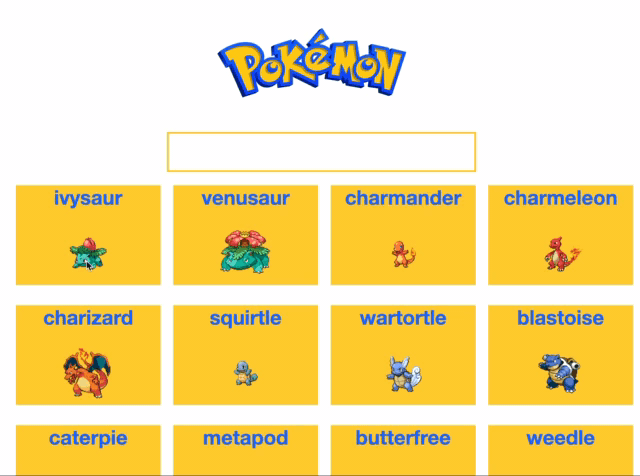

- flipping the picture
- rendering the individual items after edit (changing the dom after the fetch)
- search 
  - partial matches
  - re-render after delete

# JS Pokemon Search Assignment

Hello, your assignment today is to re-create the functionality of our Pokemon search engine:
.

- A user should be able to search for a Pokemon and see all Pokemon whose names match the search term.
- A user should be able to click a Pokemon card to see its alternate sprite.

---

## Setup

- Use `json-server` to spin up a simple RESTful API that will give you your pokemon data:
  - `$ npm install -g json-server`
  - `$ json-server --watch db.json`

---

### Deliverables:

#### Step 1: Display all the pokemon
---
When the page loads, display a card for each Pokemon. To get the data from the server, you'll need to make the following request:

- Route: `GET http://localhost:3000/pokemons`

Each Pokemon card might look something like this in HTML:

```html
<div class="pokemon-card">
  <div class="pokemon-frame">
    <h1 class="center-text">charizard</h1>
    <div class="pokemon-image">
      
    </div>
  </div>
</div>
```

Take a look at `/style.css` if you're curious about how this app is styled. Applying the classes appropriately from the snippet above should style your Pokemon cards. But don't worry if the styles don't match exactly!


#### Step 2: Flip a Pokemon (frontend)
---
When a user clicks on the image of a pokemon, it should toggle the image between the front sprite and the back sprite. Have a look at the objects returned for each pokemon: they each have a "sprites" key with image links for their front and back url, as well as a "flipped" key indicating if the back or front should be displayed.

```json
{
  "id": 2,
  "name": "ivysaur",
  ...
  "flipped": false,
  "sprites": {
    "front": "https://raw.githubusercontent.com/PokeAPI/sprites/master/sprites/pokemon/2.png",
    "back": "https://raw.githubusercontent.com/PokeAPI/sprites/master/sprites/pokemon/back/2.png"
  }
},
```

#### Step 3: Flip a Pokemon (backend)
---
When a user clicks a pokemon, you should also persist the pokemon's "flipped" key in the backend. To do this, you'll need to make a request with the following:

- Route: `PATCH http://localhost:3000/pokemons/:id`
- Headers: 
```js
{
  "Accept": "application/json",
  "Content-Type": "application/json"
}
```
- Body: 
```js
{
  "flipped": true //or false
}
```

When you refresh the page, the pokemon should display the correct sprite based on its "flipped" property: show the front sprite if flipped is false and the back sprite if flipped is true.

#### Step 4: Search Pokemon by Name
---
We'd like an easy way to search our list of pokemon. When a user types in the `#pokemon-search-input` field, the list of pokemon cards should be updated to only shows pokemon whose names match the text in the input field. 

You should include pokemon whose names are *not* exact matches (for example, if a user types in *char*, the cards for charmander, charmeleon and charizard should all be displayed. 

**HINT** You can listen for the `input` event on an `<input>` field to execute a callback function every time the value of that input field changes: [MDN Input Event](https://developer.mozilla.org/en-US/docs/Web/API/HTMLElement/input_event#Examples)

---


